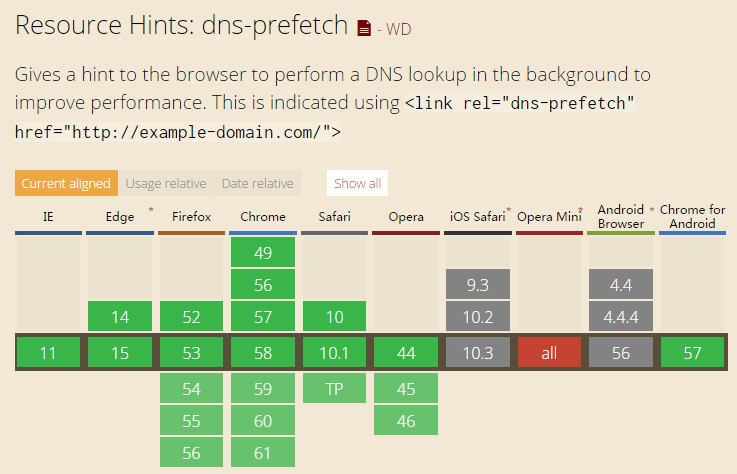
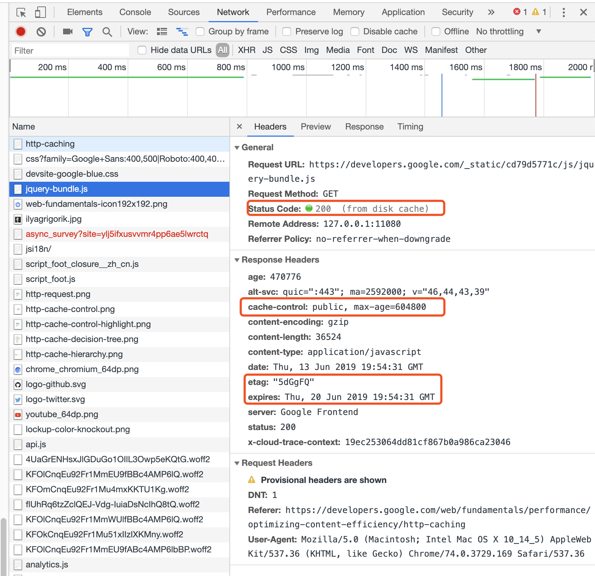

## 尽量减少HTTP请求

在浏览器(客户端)和服务器发生通信时，就已经消耗了大量的时间，尤其是在网络情况比较糟糕的时候，这个问题尤其的突出。

一个正常HTTP请求的流程简述：如在浏览器中输入"www.xxxxxx.com"并按下回车，浏览器再与这个URL指向的服务器建立连接，然后浏览器才能向服务器发送请求信息，服务器在接受到请求的信息后再返回相应的信息，浏览器接收到来自服务器的应答信息后，对这些数据解释执行。

而当我们请求的网页文件中有很多图片、CSS、JS甚至音乐等信息时，将会频繁的与服务器建立连接，与释放连接，这必定会造成资源的浪费，且每个HTTP请求都会对服务器和浏览器产生性能负担。

网速相同的条件下，下载一个100KB的图片比下载两个50KB的图片要耗费的网络资源更多。所以，请减少HTTP请求。

**具体的方法：**

1. 组合文件，优化图片，使用sprites设计风格: 将背景图片合并成一个文件，通过`background-image` 和 `background-position` 控制显示；

   确保您的图像不大于它们所需的图像，它们采用正确的文件格式（PNG通常更适用于少于16种颜色的图形，而JPEG通常更适合照片）并且它们是针对Web压缩的。

   使用CSS sprites在网站上经常使用的图像创建模板，如按钮和图标。CSS sprites将您的图像组合成一个大图像，一次加载所有（这意味着更少的HTTP请求），然后只显示您想要显示的部分。这意味着您通过不让用户等待加载多个图像来节省加载时间。

   有一些在线工具：

   - [Sprite Cow](http://www.spritecow.com/)
   - [Spritebox](https://www.spritebox.net/)

2. 肉联图片，使用`data:URL`方案将图像数据嵌入实际页面中。这可以增加HTML文档的大小。将内嵌图像组合到（缓存的）样式表中是一种减少HTTP请求并避免增加页面大小的方法。

3. 简化页面的设计


## 使用内容传送网络CDN

内容分发网络（CDN），也称为内容传送网络，是用于分发传送内容的负载的服务器网络。从本质上讲，您网站的副本存储在多个地理位置不同的数据中心，以便用户可以更快，更可靠地访问您的网站。

对于初创公司和私人网站来说，CDN服务的成本可能过高，但随着您的目标受众变得越来越大并变得更加全球化，CDN对于实现快速响应时间是必要的。

请记住，最终用户响应时间的80-90％用于下载页面中的所有组件：图像，样式表，脚本，Flash等。这是*Performance Golden Rule*。而不是从重新设计应用程序架构的艰巨任务开始，最好首先分散您的静态内容。这不仅可以大大缩短响应时间，而且由于内容交付网络，它更容易实现。

内容传送网络（CDN）是分布在多个位置的Web服务器的集合，以更有效地向用户传送内容。选择用于向特定用户传送内容的服务器通常基于网络接近度的度量。例如，选择具有最少网络跳数的服务器或具有最快响应时间的服务器。

> CDN服务商有很多，这里就不再多说：专门做CDN服务器的蓝讯、网宿、帝联、快网，还有阿里云、腾讯云、华为云等。国外如[Akamai Technologies](http://www.akamai.com/)，[EdgeCast](http://www.edgecast.com/)或[level3](http://www.level3.com/index.cfm?pageID=36)


除了去购买一些CDN服务商的服务以外，对于大多数开发者，可以使用公共CDN网络上的资源，如以下的方式去使用CDN加速：

```html
<!-- google -->
<script
  type="text/javascript"
  src="http://ajax.googleapis.com/ajax/libs/jquery/2.1.0/jquery.min.js"
></script>

<!-- cdnjs -->
<script src="https://cdnjs.cloudflare.com/ajax/libs/jquery/3.4.1/jquery.min.js"></script>

<!-- qiniu cloud -->
<script src="https://cdn.staticfile.org/jquery/3.4.1/jquery.min.js"></script>

<!-- other cdn -->
<script
  crossorigin="anonymous"
  integrity="sha384-vk5WoKIaW/vJyUAd9n/wmopsmNhiy+L2Z+SBxGYnUkunIxVxAv/UtMOhba/xskxh"
  src="https://lib.baomitu.com/jquery/3.4.1/jquery.min.js"
></script>
```


## 避免空src或者是href值

空的src和href都会导致多余的HTTP请求，虽然不影响加载时间，但是会对服务器产生不必要的流量和压力。浏览器仍然会向服务器发起一个 HTTP 请求：

- IE 向页面所在的目录发送请求
- Safari、Chrome、Firefox 向页面本身发送请求
- Opera 不执行任何操作

空的src的image严重的以至于影响整个网站的用户体验，空 `src` 产生请求的后果不容小憩：

- 给服务器造成意外的流量负担，尤其时日 PV 较大时；
- 浪费服务器计算资源；
- 可能产生报错。

有两种形式：

1. HTML形式

   ```html
   
   <a href=""></a>
   ```

2. JavaScript形式

   ```javascript
   var img = new Image();
   img.src = "";
   ```

   

解决办法：

1. 删除空的`src`和`href`标签
2. 给`a`标签的`href`属性，连接到实际的页面：

```html
<a href="#"></a>
<a href="#nogo"></a>
<a href="##"></a>
<a href="###"></a>
<a href="void(0);"></a>
<a href="void(0)"></a>
<a href=";"></a>
<a href=""></a>
```

3. 禁止跳转，添加`cursor:pointer`样式

```html
<style>
    a{cursor: pointer}
</style>
<a>点击一</a>
<a onclick="doSomething()">点击二</a>
```

4. 给`a` 标签创建一个带有描述信息的`href` 属性，并监控`click`事件调用`preventDefault()`函数。

```html
<a href="#Something_De scriptive" id="my_id">Trigger</a>
<script>
    $("#my_id").click(function(e){
        e.preventDefault(); //取消单击事件的默认动作以阻止链接的跳转。
        //  其他的代码
})
</script>
```

优点：

- 让`<a>`够响应键盘事件并获得焦点（从而屏幕阅读器能够读出背后的内容，增强可访问性）
- 优雅降级，在网络连接很差，还没有加载到CSS的时候，`<a>`依然有手型与正常的link样式。


#### gzip的组件

所有现代浏览器都支持 `gzip` 压缩并会为所有 HTTP 请求自动协商此类压缩。启用 `gzip` 压缩可大幅缩减所传输的响应的大小（最多可缩减 90%），从而显著缩短下载相应资源所需的时间、减少客户端的流量消耗并加快网页的首次呈现速度。 

从HTTP / 1.1开始，Web客户端表示支持使用HTTP请求中的Accept-Encoding标头进行压缩。

```
Accept-Encoding：gzip，deflate
```

压缩包括XML和JSON在内的任何文本响应都是值得的。不应对图像和PDF文件进行gzip压缩，因为它们已经过压缩。试图对它们进行gzip不仅会浪费CPU，还可能会增加文件大小。

比如，在nginx中开启gzip压缩：

```bash
# 开启gzip
gzip on;
# 启用gzip压缩的最小文件，小于设置值的文件将不会压缩
gzip_min_length 1k;
# gzip 压缩级别，1-10，数字越大压缩的越好，也越占用CPU时间，后面会有详细说明
gzip_comp_level 2;
# 进行压缩的文件类型。javascript有多种形式。其中的值可以在 mime.types 文件中找到。
gzip_types text/plain application/javascript application/x-javascript text/css application/xml text/javascript application/x-httpd-php image/jpeg image/gif image/png font/ttf font/otf image/svg+xml;
# 是否在http header中添加Vary: Accept-Encoding，建议开启
gzip_vary on;
# 禁用IE 6 gzip
gzip_disable "MSIE [1-6]\.";
```

其他web容器启动gzip的方法：

- Apache：使用 [mod_deflate](http://httpd.apache.org/docs/current/mod/mod_deflate.html)
- Nginx：使用 [ngx_http_gzip_module](http://nginx.org/en/docs/http/ngx_http_gzip_module.html)
- IIS：[配置 HTTP 压缩功能](http://technet.microsoft.com/en-us/library/cc771003(v=WS.10).aspx)


## CSS放在顶部，JS放在底部

把Javascript脚本在底部，删除阻止渲染的JavaScript
在HTML文件`<body>`中指定外部样式表和内联样式块可能对浏览器的渲染性能产生不利影响。

1. 浏览器阻塞渲染网页直到所有外部的样式表都已被下载。
2. （用`<style>`标记指定的）内联样式块可能会导致reflows和页面跳动。
   因此，把外部样式表和内联样式块放在页面的`<head>`中是很重要的。通过确保样式表首先被下载和解析，可以让浏览器逐步渲染页面。


具体做法：

- 将内联样式块和`<link>`元素从页面`<body>`移动到页面`<head>`中。

  HTML 4.01规范（第12.3节）规定，始终把使用`<link>`标签的外部样式表放在`<head>`部分里，还要确保您指定的样式有正确的顺序。

- 把`<style>`区块放在`<head>`部分里。

- 使用css媒体类型

如果可以让`CSS`资源只在特定条件下使用，这样这些资源就可以在首次加载时先不进行构建`CSSOM`树，只有在符合特定条件时，才会让浏览器进行阻塞渲染然后构建`CSSOM`树。

`CSS`的媒体查询正是用来实现这个功能的，它由媒体类型以及零个或多个检查特定媒体特征状况的表达式组成。

```html
<!-- 没有使用媒体查询，这个css资源会阻塞渲染  -->
<link href="style.css"    rel="stylesheet">
<!-- all是默认类型，它和不设置媒体查询的效果是一样的 -->
<link href="style.css"    rel="stylesheet" media="all">
<!-- 动态媒体查询， 将在网页加载时计算。
根据网页加载时设备的方向，portrait.css 可能阻塞渲染，也可能不阻塞渲染。-->
<link href="portrait.css" rel="stylesheet" media="orientation:portrait">
<!-- 只在打印网页时应用，因此网页首次在浏览器中加载时，它不会阻塞渲染。 -->
<link href="print.css"    rel="stylesheet" media="print">
```

使用媒体查询可以让CSS资源不在首次加载中阻塞渲染，但不管是哪种CSS资源它们的下载请求都不会被忽略，浏览器仍然会先下载CSS文件。


**把Javascript脚本在底部，删除阻止渲染的JavaScript**

浏览器必须通过在呈现页面之前解析HTML来构建DOM树。如果您的浏览器在此过程中遇到脚本，则必须先停止并执行它，然后才能继续。

具体做法：

将脚本定义或引用放置到`<body>`底部。
`<script defer="defer">` defer 属性规定是否对脚本执行进行延迟， 脚本将在页面完成解析时执行。


蓝色线代表网络读取，红色线代表执行时间，这俩都是针对脚本的；绿色线代表 HTML 解析。

此图告诉我们以下几个要点：

1. `defer`和 `async` 在网络读取（下载）这块儿是一样的，都是异步的（相较于 HTML 解析）
2. 它俩的差别在于脚本下载完之后何时执行，显然 `defer`*是最接近我们对于应用脚本加载和执行的要求的
3. 关于 `defer`，此图未尽之处在于它是按照加载顺序执行脚本的，这一点要善加利用
4. `async` 则是一个乱序执行的主，反正对它来说脚本的加载和执行是紧紧挨着的，所以不管你声明的顺序如何，只要它加载完了就会立刻执行
5. 仔细想想，`async`对于应用脚本的用处不大，因为它完全不考虑依赖（哪怕是最低级的顺序执行），不过它对于那些可以不依赖任何脚本或不被任何脚本依赖的脚本来说却是非常合适的，最典型的例子：Google Analytics


#### 减少DNS查找

用户访问网站的过程如下：

1. 在地址栏输入网站地址，如www.example.com;
2. 本地DNS得到这个请求，查询本地DNS缓存，如果有这条记录，则直接返回对应的IP；否则，请求网络上的DNS服务器，得到相应的IP，返回给客户机，并缓存这条记录；

3. 浏览器向得到的IP发起建立连接请求，得到响应后建立连接，请求数据；

4. Server端计算所需数据，并返回给client端；

5. client端，即浏览器，解析数据并显示在浏览器窗口中，至此，请求完成。

在 一次请求中，DNS解析可以占到请求时间的三分之一左右（这点有待验证），所以如果可以缩短DNS解析时间，就可以加快页面的打开速度。

缩短DNS解析的 方法可以**通过延长DNS缓存的时间**，**选用更快的DNS Server**，**减少域名总数**（例如原来有5个img server，分别为img1.xxx.com至img5.xxx.com，则现在可以减少到3个）等等，但是减少域名个数又会降低资源并行下载的数量， 因为同一域名最多可以并行下载两个资源，所以这里需要一个折衷方案，作者的建议就是将资源分布在大于等于2但小于等于4个域名上（这个也有待验证，例如针 对多大的系统选用多少个域名是最合理的等）。

**使用DNS预解析**

这里会有一些兼容性问题，可以参见：[http://caniuse.com/#feat=link-rel-dns-prefetch](http://caniuse.com/#feat=link-rel-dns-prefetch)



在网页体验中我们常会遇到这种情况，即在调用百度联盟、谷歌联盟以及当前网页所在域名外的域名文件时会遇到请求延时非常严重的情况。那么有没有方法去解决这种请求严重延时的现象呢？

一般来说这种延时的原因不会是对方网站带宽或者负载的原因，那么到底是什么导致了这种情况呢。湛蓝试着进行推测，假设是DNS的问题，因为DNS解析速度很可能是造成资源延时的最大原因。在页面header中添加了以下代码（用以DNS预解析）：

```html
<meta http-equiv="x-dns-prefetch-control" content="on" />

<link rel="dns-prefetch" href="http://bdimg.share.baidu.com" />
<link rel="dns-prefetch" href="http://nsclick.baidu.com" />
<link rel="dns-prefetch" href="http://hm.baidu.com" />
<link rel="dns-prefetch" href="http://eiv.baidu.com" />
```

dns-prefetch需慎用，多页面重复DNS预解析会增加重复DNS查询次数。


使用场景：

1. 新用户访问，后端可以通过 Cookie 判断是否为首次进入站点，对于这类用户，DNS Prefetch 可以比较明显地提升访问速度
2. 登录页，提前在页面上进行下一跳页用到资源的 DNS Prefetch
3. 页面中的静态资源在不同的domain下，如CSS、JS、图片等文件
4. 电商网站的商品页大量载入不同domain下的商品图，如淘宝
5. 手机网页
6. 大型网站
7. js或服务端重定向


> Chrome中的一些指令：
>
> - `chrome://histograms/DNS.PrefetchQueue`：查看队列状态
> - `chrome://histograms/DNS`：查看从浏览器启动到上一页的DNS记录
> - `chrome://dns`：查看个域名DNS统计
> - `chrome://net-internals/#dns`：清除host缓存

#### 压缩资源

- 压缩js，css，image

  **通过对外部资源进行压缩可以大幅度地减少浏览器需要下载的资源量，它会减少关键路径长度与关键字节，使页面的加载速度变得更快。**

  **对数据进行压缩其实就是使用更少的位数来对数据进行重编码**。如今有非常多的压缩算法，且每一个的作用领域也各不相同，它们的复杂度也不相同，不过在这里我不会讲压缩算法的细节，感兴趣的朋友可以自己Google。

  在对`HTML`、`CSS`和`JavaScript`这些文件进行压缩之前，还需要先进行一次冗余压缩。**所谓冗余压缩，就是去除多余的字符，例如注释、空格符和换行符**。这些字符对于程序员是有用的，毕竟没有格式化的代码可读性是非常恐怖的，但它们对于浏览器是没有任何意义的，去除这些冗余可以减少文件的数据量。

  小图片采用base64的格式，直接嵌入代码中，可以帮我们减少http请求，但是同样，这个会造成我们代码的提及变大。请求的速度会减慢，这个需要平衡。

  常用工具：webpack，gulp

  > 浏览器接收到服务器返回的HTML、CSS和JavaScript字节数据并对其进行解析和转变成像素的渲染过程被称为`关键渲染路径`。通过优化关键渲染路径即可以缩短浏览器渲染页面的时间。

- 删除重复的脚本，类似`tree-shaking`

  在一个页面中重复引用一个脚本可能存在的问题：浏览器会重复下载并执行脚本文件。

- 使用合适大小的图片

  如果你只需要一个小图，就不要传一个大图。例如你实际需要显示的是一个60x60的头像，就不要传一个100x100的然后再通过设置宽高将它缩小为60x60的。原因很简单，这样会消耗不必要的带宽和系统资源。

- 减少DOM元素的数量

  复杂页面意味着要下载更多字节，这也意味着JavaScript中的DOM访问速度更慢。如果您想要添加事件处理程序，例如，在页面上循环500或5000个DOM元素，则会有所不同。

- 使用异步加载，async、defer

  > 服务端渲染也是一种减少浏览器资源消耗，减少页面重排重绘，也是一种现行MVVM框架单页应用最主要的SEO优化手段。


#### 避免3xx/4xx

**避免重定向**

3xx是重定向相关的HTTP响应代码

重定向的意思是，用户的原始请求（例如请求A）被重定向到其他的请求（例如请求B）。

每次页面重定向到另一个页面时，您的访问者都会面临等待HTTP请求 - 响应周期完成的额外时间。例如，如果移动重定向模式如下所示：

`example.com` - > `www.example.com` - > `m.example.com` - > `m.example.com/home`，这两个额外重定向中的每一个都会使您的页面成为可能加载速度慢。

HTTP 重定向通过 `301`/`302` 状态码实现。

```
HTTP/1.1 301 Moved Permanently  
Location: http://example.com/newuri  
Content-Type: text/html  
```

`301 Moved Permanently`，这个状态码标识用户所请求的资源被移动到了另外的位置，客户端接收到此响应后，需要发起另外一个请求去下载所需的资源。

`302 Found`，这个状态码标识用户所请求的资源被找到了，但不在原始位置，服务器会回复其他的一个位置，客户端收到此响应后，也需要发起另外一个请求去下载所需的资源。

客户端收到服务器的重定向响应后，会根据响应头中 `Location` 的地址再次发送请求。重定向会影响用户体验，尤其是多次重定向时，用户在一段时间内看不到任何内容，只看到浏览器进度条一直在刷新。

有时重定向无法避免，在糟糕也比抛出 `404` 好。虽然通过 [HTML meta refresh](https://link.juejin.im/?target=https%3A%2F%2Fen.wikipedia.org%2Fwiki%2FMeta_refresh) 和 JavaScript 也能实现，但首选 HTTP `3xx` 跳转，以保证浏览器「后退」功能正常工作（也利于 SEO）。


**常见的优化办法：**

- 最浪费的重定向经常发生、而且很容易被忽略：URL 末尾应该添加 `/` 但未添加。比如，访问 `http://astrology.yahoo.com/astrology` 将被 301 重定向到 `http://astrology.yahoo.com/astrology/`（注意末尾的 `/`）。如果使用 Apache，可以通过 `Alias` 或 `mod_rewrite` 或 `DirectorySlash` 解决这个问题。
- 网站域名变更：CNAME 结合 `Alias` 或 `mod_rewrite` 或者其他服务器类似功能实现跳转。

- 在定义链接地址的href属性的时候，尽量使用最完整的、直接的地址。例如：
  使用 `www.cnblogs.com` 而不是`cnblogs.com`
  使用`cn.bing.com`而不是`bing.com`
  使用`www.google.com.hk`而不是`google.com`
  使用`www.mysite.com/products/`而不是`www.mysite.com/products`


**避免404浏览器找不到资源的情况发生**

发出HTTP请求并获得无用的响应（即404 Not Found）是完全没必要的。特别糟糕的是当外部JavaScript的链接错误并且结果是404时。首先，此下载将阻止并行下载。接下来，浏览器可能会尝试解析404响应主体，就像它是JavaScript代码一样，这样就带来的性能的浪费。

**404的影响：**

有时候，404错误发生了，用户可能根本没有感觉到。例如

- 例如请求favicon.ico文件，或者请求了某个不存在的脚本文件、样式表、图片文件，页面还是会按照正常的方式进行呈现。
- 丢失的脚本文件、样式表、图片文件，会导致页面的某些行为、界面效果出现异常（也可能不是很明显）
- 最大的问题可能是性能方面的影响。尤其是如果请求一个不存在的脚本文件，因为浏览器在请求脚本文件的时候，即便是返回404，它也会尝试去按照Javascript的方式解析响应中的内容。这无疑会增加很多处理的时间，而因为该文件不存在，所以这些都是无用功。

看得到的影响：

- 如果用户请求的某个页面不存在，那么他将收到明确的回应
- 默认情况下，他将收到一个标准的错误页面（请注意：不少用户会被这个页面吓到）


**常见的优化办法：**

404 意味着Not Found，意思是说未找到资源。既然如此，那么至少会有两种原因导致404错误：

- 该资源按理说是要有，但我们没有提供。用户按照正常的方式来请求，所以资源找不到。
  - 为网站提供favicon.ico这种经常可能会被忽略的资源
  - 使用一些检查工具：比如Link checker
- 该资源本来就不存在，用户按照不正常的方式来请求，当然还是找不到。
  - 避免用户收藏绝对地址，给后期更新带来隐患。可以使用地址Rewrite来重写，或者在设计阶段定义一些灵活友好的地址
  - 使用Routing技术，配置路由规则。


#### AJAX优化

**使Ajax可缓存**

AJAX=Asynchronous JavaScript And XML，AJAX不是新的编程语言，而是一种使用现有标准的新方法。
AJAX是与服务器交换数据并更新部分网页的艺术，在不重新加载整个页面的情况下。

由于AJAX其实也是需要发起请求，然后服务器执行，并将结果（通常是JSON格式的）发送给浏览器进行最后的呈现或者处理，所以对于网站设计优化的角度而言，我们同样需要考虑对这些请求，是否可以尽可能的利用到缓存的功能来提高性能。

对于AJAX而言，有一些特殊性，并不是所有的AJAX请求都是可以缓存的。

1. `POST`的请求，是不可以在客户端缓存的，每次请求都需要发送给服务器进行处理，每次都会返回状态码200。（这里可以优化的是，服务器端对数据进行缓存，以便提高处理速度）
2. `GET`的请求，是可以（并且默认）在客户端进行缓存的，除非指定了不同的地址，否则同一地址的AJAX请求，不会重复再服务器执行，而是返回304。


有的时候，我们可能希望`GET`请求不被缓存，有几种做法来达到这样的目的。

1. 每次调用的时候，请求不同的地址（可以在原始地址后面添加一个随机的号码）。
2. 如果你所使用的是jquery的话，则可以考虑禁用AJAX的缓存。

```javascript
$.ajaxSetup({ cache: false });
```

axios中

```javascript
var config = {	headers: {'Content-Type': 'application/json','Cache-Control' : 'no-cache'}};
 
axios.get('/post',config)
```


**使用GET的Ajax请求**

在使用XMLHttpRequest（目前的AJAX都是基于它实现的）的时候，浏览器中的POST实现为两步走的过程，首先发送头部信息，然后再发送数据。但如果是使用GET的话，就只有一个TCP的包发送出去（除非有大量的Cookie），这样无疑可以提高性能。

但是get有容量限制，大于2K(对get的限制IE是2K，firefox、chrome是4K)的内容只能用post。


#### Cookie优化

- 减小cookie大小

  减小cookie的大小，因为在发请求时浏览器会将cookie信息发送到server端，所以应该只在cookie中存必要的信息且越长度越小越好。在 写cookie的时候要记得给cookie设置一个合理的过期时间及域

- 对一些静态资源不需要使用cookie的单独设置域

  当浏览器发出静态图像请求并将cookie与请求一起发送时，服务器对这些cookie没有任何用处。因此，他们只会毫无理由地创建网络流量。您应该确保使用无cookie请求请求静态组件。创建一个子域并在那里托管所有静态组件。

  如果您的域名是`www.example.org`，您可以托管您的静态组件`static.example.org`。但是，如果您已经在顶级域上设置了cookie `example.org`而不是`www.example.org`，则所有请求都 `static.example.org`将包含这些cookie。在这种情况下，您可以购买一个全新的域，在那里托管您的静态组件，并保持此域无cookie。雅虎 用途`yimg.com`，YouTube使用`ytimg.com`，亚马逊使用`images-amazon.com`等。

  在无cookie域上托管静态组件的另一个好处是，某些代理可能拒绝缓存使用cookie请求的组件。在相关说明中，如果您想知道是否应该使用`example.org`或`www.example.org`作为主页，请考虑cookie的影响。

  > 省略www会让您别无选择，只能写入cookie `*.example.org`，因此出于性能原因，最好使用www子域并将cookie写入该子域。


归类一下：

- 去除不必要的 Cookie；
- 尽量压缩 Cookie 大小；
- 注意设置 Cookie 的 domain 级别，如无必要，不要影响到 sub-domain；
- 设置合适的过期时间。


#### 利用缓存

浏览器会缓存大量信息（样式表，图像，JavaScript文件等），以便当访问者返回您的站点时，浏览器不必重新加载整个页面。然后设置“expires”标题，以表示希望缓存该信息的时间。在许多情况下，除非您的网站设计经常更改，否则一年是合理的时间段。


**利用浏览器缓存 ，为链接或者资源，添加Expires或Cache-Control头**

- 对于静态组件：通过设置远期未来`Expires`标头实现“永不过期”策略
- 对于动态组件：使用适当的`Cache-Control`标头来帮助浏览器处理条件请求

格式：

```bash
Expires = "Expires" ":" HTTP-date
# e.g.
Expires: Thu, 01 Dec 1994 16:00:00 GMT 
#（必须是GMT格式）
```


通过HTTP的META设置expires和cache-control

```html
<meta http-equiv="Cache-Control" content="max-age=7200" />
<meta http-equiv="Expires" content="Mon, 01 Aug 2019 00:00:00 GMT" />
```

上述设置仅为举例，实际使用其一即可。这样写的话仅对该网页有效，对网页中的图片或其他请求无效，并不会做任何`cache`。
这样客户端的请求就多了，尽管只是检查`Last-modified`状态的东西，但是请求一多对浏览速度必定有影响。

`Cache-Control` 的参数包括:

- **max-age=**[单位：秒 seconds] — 设置缓存最大的有效时间. 类似于 `Expires`, 但是这个参数定义的是时间大小（比如：60）而不是确定的时间点.单位是[秒 seconds].
- **s-maxage=**[单位：秒 seconds] — 类似于 `max-age`, 但是它只用于公享缓存 (e.g., proxy) .
- **public** — 响应会被缓存，并且在多用户间共享。正常情况, 如果要求 [HTTP 认证](http://baike.baidu.com/view/2076408.htm),响应会自动设置为 private.
- **private** — 响应只能够作为私有的缓存(e.g., 在一个浏览器中)，不能再用户间共享。
- **no-cache** — 响应不会被缓存,而是实时向服务器端请求资源。这一点很有用，这对保证[HTTP 认证](http://baike.baidu.com/view/2076408.htm)能够严格地禁止缓存以保证安全性很有用（这是指页面与public结合使用的情况下）.既没有牺牲缓存的效率，又能保证安全。
- **no-store** — 在任何条件下，响应都不会被缓存，并且不会被写入到客户端的磁盘里，这也是基于安全考虑的某些敏感的响应才会使用这个。
- **must-revalidate** — 响应在特定条件下会被重用，以满足接下来的请求，但是它必须到服务器端去验证它是不是仍然是最新的。
- **proxy-revalidate** — 类似于 `must-revalidate`,但不适用于代理缓存.


**把css与js使用外联的方式进行使用**

建议将css和js以外联方式引用以充分利用`cache`，只有一个例外就是针对首页，首页可以采用内联来减少http请求数，加快页面显示速度，文中说首 页内联的原因是首页被人们访问的次数不会太多，而且样式一般比较特殊，不像其它页面一样有相同的页面模板（因为就有相同的样式部分），所以首页的样式可以 内联。并且应该在首页加载完成之后，再在后台动态加载后续页面的css和js，以提高后续页面的访问速度。

如果站点上的用户每个会话有多个页面查看，并且您的许多页面重复使用相同的脚本和样式表，则缓存的外部文件可能会带来更大的潜在好处。

> 对于现在的单页面的应用，更适合于动态加载的方案


**缓存favicon.ico，并设置最好小于1k**

favicon.ico是一个保留在服务器根目录中的图片，为了减轻拥有favicon.ico的带来的性能问题，请确保：

- 优化它的大小，最好不到1K。
- 设置Expires标头，使其缓存。


**配置的ETag**

ETag，全程为：`Entity Tag`，意思是实体标签，它属于HTTP协议的一部分，也就是所有的Web服务器都应该支持这个特性。它的作用是用一个特殊的字符串来标识某个资源的“版本”，客户端（浏览器）请求的时候，比较ETag如果一致，则表示该资源并没有被修改过，客户端（浏览器）可以使用自己缓存的版本，避免重复下载。
它比last-modified date更具有弹性，例如某个文件在1秒内修改了10次，Etag可以综合Inode(文件的索引节点(inode)数)，MTime(修改时间)和Size来精准的进行判断，避开UNIX记录MTime只能精确到秒的问题。 服务器集群使用，可取后两个参数。使用ETags减少Web应用带宽和负载。

| 响应标       | 优势 和特点                                                  | 劣势 和可能的问题                                            |
| :----------- | :----------------------------------------------------------- | :----------------------------------------------------------- |
| Expires      | - HTTP 1.0就有，简单易用。 - 服务器通过这个Header告诉浏览器，某资源直到某个时间才会过期，所以在没有过期之前，浏览器就直接使用本地的缓存了。 | - 因为这是时间是由服务器发送的（UTC），但如果服务器时间和客户端事件存在不一致，可能会有些问题。 - 可能存在版本的问题，因为如果在到期之前修改过了，客户端是不会知道的。 - Cache-Control中的max-age可以实现类似的效果，但更加好，因为max-age是一个以秒为单位的时间数，而不是具体的时间，所以不存在上面提到的第一个问题。 |
| Cache-Contro | - 服务器通过一个Header（Last-Modified）告诉浏览器，某资源最后修改的时间。 - 浏览器在请求的时候，包含一个Header（If-Modified-Since）,然后服务器可以进行比较，如果在该时间后没有修改过，则返回304。 - 它比Expires多很多选项设置 | - Last-Modified 也是一个时间，但该时间只能精确到秒，如果在同一个秒中有多次修改（这个在现在的环境下应该确实是可能的），则可能会发生问题。 |
| ETag         | - 可以更加精确地判断资源是否被修改，因为它不是一个时间值，而是对时间经过处理的一个长整型数值（当然具体算法我们目前还不得而知）。 - 浏览器发起新请求时需要包含 If-None-Match。 | - 如果部署在服务器场环境中，配置不当的话，可能每个服务器会对相同的资源生成不一样的ETag，这样就增加了重复下载的可能性。 |


我们来看一个真实的例子：




其他的一些缓存使用：

- 使用本地缓存，缓存部分常用用户数据、公开数据
- 缓存机制设计：缓存+过期时间


总结一下：

- 添加Expires或Cache-Control
- Etag
- 缓存favicon.ico
- 外联js/css


#### 缩短服务器响应时间

服务器响应时间受到访问流量，每个页面使用的资源，服务器使用的软件以及硬件本身的影响。要改善服务器响应时间，请查找性能瓶颈，如慢速数据库查询，慢速路由或缺少足够的内存并修复它们。最佳服务器响应时间低于200毫秒。

很多潜在因素都可能会延缓服务器响应，例如缓慢的应用逻辑、缓慢的数据库查询、缓慢的路由、框架、库、资源 CPU 不足或内存不足。您需要充分考虑所有这些因素，才能改善服务器的响应用时。 若想找出服务器响应用时过长的原因，首先要进行衡量。然后，准备好相关数据，并参阅有关如何解决该问题的相应指导。当解决问题后，您必须继续衡量服务器响应用时，并设法应对任何会在将来出现的性能瓶颈问题。

1. **收集并检查**现有性能和数据。若无可用内容，请使用自动化的网络应用监测解决方案（市面上有托管的开源版本，适用于大多数平台）进行评估，或添加自定义的方法。
2. **找出并修复**首要的性能瓶颈问题。如果z您使用的是热门网页框架或内容管理平台，请参阅与性能优化最佳做法相关的文档。
3. **监测并提醒**任何会在将来出现的性能衰退问题！

> 通常来说，服务器的响应时间由数据库的问题居多，还有错误的程序设计(比如：烂用for循环去查数据库)。


### 优化工作清单

当小伙伴们出现了页面性能问题时，或者在设计我们的应用之前，就可以参考如下的条目进行快速检查。

- 页面内容
  - 减少 HTTP 请求数
  - 减少 DNS 查询
  - 避免重定向
  - 缓存 Ajax 请求
  - 延迟加载
  - 预先加载
  - 减少 DOM 元素数量
  - 划分内容到不同域名
  - 尽量减少 iframe 使用
  - 避免 404 错误
- 服务器
  - 使用 CDN
  - 添加 Expires 或 Cache-Control 响应头
  - 启用 Gzip
  - 配置 Etag
  - 尽早输出缓冲
  - Ajax 请求使用 GET 方法
  - 避免图片 src 为空
- Cookie
  - 减少 Cookie 大小
  - 静态资源使用无 Cookie 域名
- CSS
  - 把样式表放在 `<head>` 中
  - 不要使用 CSS 表达式
  - 使用 `link` 替代 `@import`
  - 不要使用 filter
- JavaScript
  - 把脚本放在页面底部
  - 使用外部 JavaScript 和 CSS
  - 压缩 JavaScript 和 CSS
  - 移除重复脚本
  - 减少 DOM 操作
  - 使用高效的事件处理
- 图片
  - 优化图片
  - 优化 CSS Sprite
  - 不要在 HTML 中缩放图片
  - 使用体积小、可缓存的 favicon.ico
- 移动端
  - 保持单个文件小于 25 KB
  - 打包内容为分段（multipart）文档
