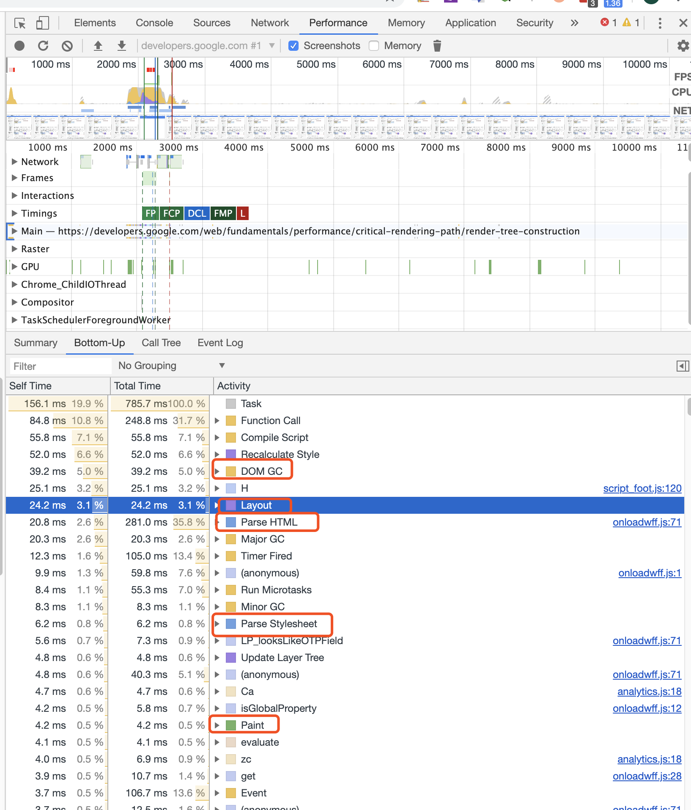

#### 浏览器的渲染机制

对于渲染，我们首先需要了解一个概念：设备刷新率。

设备刷新率是设备屏幕渲染的频率，通俗一点就是，把屏幕当作墙，设备刷新率就是多久重新粉刷一次墙面。基本我们平常接触的设备，如手机、电脑，它们的默认刷新频率都是60FPS，也就是屏幕在1s内渲染60次，约16.7ms渲染一次屏幕。

这就意味着，我们的浏览器最佳的渲染性能就是所有的操作在一帧16.7ms内完成，能否做到一帧内完成直接决定着渲染性，影响用户交互。

渲染引擎一开始会从网络层获取请求文档的内容，内容的大小一般限制在 8000 个块以内。

然后进行如下所示的**基本流程**：

渲染引擎将开始解析 HTML 文档，并将各标记逐个转化成“内容树”上的 [DOM](https://www.html5rocks.com/zh/tutorials/internals/howbrowserswork/#DOM) 节点。同时也会解析外部 CSS 文件以及样式元素中的样式数据。HTML 中这些带有视觉指令的样式信息将用于创建另一个树结构：[呈现树](https://www.html5rocks.com/zh/tutorials/internals/howbrowserswork/#Render_tree_construction)。

呈现树包含多个带有视觉属性（如颜色和尺寸）的矩形。这些矩形的排列顺序就是它们将在屏幕上显示的顺序。

呈现树构建完毕之后，进入“[布局](https://www.html5rocks.com/zh/tutorials/internals/howbrowserswork/#layout)”处理阶段，也就是为每个节点分配一个应出现在屏幕上的确切坐标。下一个阶段是[绘制](https://www.html5rocks.com/zh/tutorials/internals/howbrowserswork/#Painting) - 渲染引擎会遍历呈现树，由用户界面后端层将每个节点绘制出来。

需要着重指出的是，这是一个渐进的过程。为达到更好的用户体验，渲染引擎会力求尽快将内容显示在屏幕上。它不必等到整个 HTML 文档解析完毕之后，就会开始构建呈现树和设置布局。在不断接收和处理来自网络的其余内容的同时，渲染引擎会将部分内容解析并显示出来。

> 那么我们知道了，CSSOM 树和 DOM 树合并成渲染树，然后用于计算每个可见元素的布局，并输出给绘制流程，将像素渲染到屏幕上。优化上述每一个步骤对实现最佳渲染性能至关重要。

具体的流程：

- DOM 树与 CSSOM 树合并后形成渲染树。
- 渲染树只包含渲染网页所需的节点。
- 布局计算每个对象的精确位置和大小。
- 最后一步是绘制，使用最终渲染树将像素渲染到屏幕上。

> 请注意 `visibility: hidden` 与 `display: none` 是不一样的。前者隐藏元素，但元素仍占据着布局空间（即将其渲染成一个空框），而后者 (`display: none`) 将元素从渲染树中完全移除，元素既不可见，也不是布局的组成部分。

 

我们以webkit的渲染作为示例：

我们可以使用调试工具来看一个真实的例子：

`script`标签的处理

JS可以操作DOM来修改DOM结构，可以操作CSSOM来修改节点样式，这就导致了浏览器在解析HTML时，一旦碰到`script`，就会立即停止HTML的解析（而CSS不会），执行JS，再返还控制权。

事实上，JS执行前不仅仅是停止了HTML的解析，它还必须等待CSS的解析完成。当浏览器碰到`script`元素时，发现该元素前面的CSS还未解析完，就会等待CSS解析完成，再去执行JS。

JS阻塞了HTML的解析，也阻塞了其后的CSS解析，整个解析进程必须等待JS的执行完成才能够继续，这就是所谓的JS阻塞页面。一个script标签，推迟了DOM的生成、CSSOM的生成以及之后的所有渲染过程，从性能角度上讲，将`script`放在页面底部，也就合情合理了。

简单来说：渲染线程与JS引擎线程是互斥的，当JS引擎执行时渲染线程会被挂起（相当于被冻结了），渲染更新会被保存在一个队列中等到JS引擎空闲时立即被执行。

总结一下：

浏览器的渲染流程分为：

- DOM树构建 
- CSSOM树构建 
- RenderObject树构建 
- 布局
- 绘制
