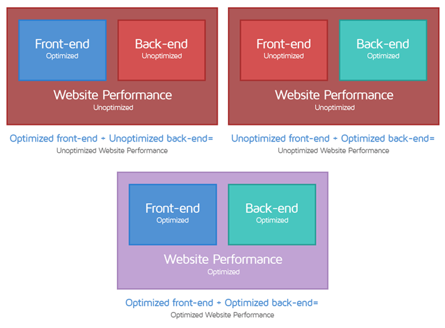

#### 浏览器部分

- 网络层面

  1. 过多的HTTP请求

     打开一个网页的时候，后台程序的响应并不所需太多时间，等待的时间主要花费在下载网页元素上了，即HTML、CSS、JavaScript、Flash、图片等。据统计，每增加一个元素，网页载入的时间就会增加25-40毫秒（具体取决于用户的带宽情况）。

  2. 资源访问带宽小

     两方面，一方面是客户端的带宽，一方面是服务器端的带宽。

  3. 网页元素(图片、视频、样式)太大

- 浏览器渲染层面

  1. 渲染阻塞：

     浏览器想要渲染一个页面就必须先构建出`DOM`树与`CSSOM`树，如果`HTML`与`CSS`文件结构非常庞大与复杂，这显然会给页面加载速度带来严重影响。

     所谓渲染阻塞资源，即是对该资源发送请求后还需要先构建对应的`DOM`树或`CSSOM`树，这种行为显然会延迟渲染操作的开始时间。

     JS阻塞与CSS阻塞：

     **HTML、CSS、JavaScript都是会对渲染产生阻塞的资源，HTML是必需的（没有DOM还谈何渲染），但还可以从CSS与JavaScript着手优化，尽可能地减少阻塞的产生。**

  2. 重复渲染
  3. DNS解析

- 服务端层面

  1. 硬件配置低：这个是双向的
  2. 服务器软件，比如防火墙、内网策略等
  3. 未对Nginx这类web服务器进行配置优化
  4. CPU占满、数据库未优化
  5. 代码问题，代码效率，代码性能
  6. 包含了过多的分析类工具

#### 代码部分

- 构建层面

  未对代码进行打包、压缩、兼容性优化。

  未合并重复的请求、代码。

- 编码层面

  没有良好的编码习惯，错误的编排JS与CSS

  for循环、迭代、同步、重定向、阻塞请求

  未删除重复、无用的代码

  未对逻辑业务复杂的代码进行重构，了解设计模式，对业务进行疏理

- 机制(SSR，英文Server Side Render：服务器端渲染)

  未加入Async异步机制

  未思考页面加载、用户体验

- 规范

  CSS规范

  HTML规范/HTML5规范

  Airbnb代码规范等。
